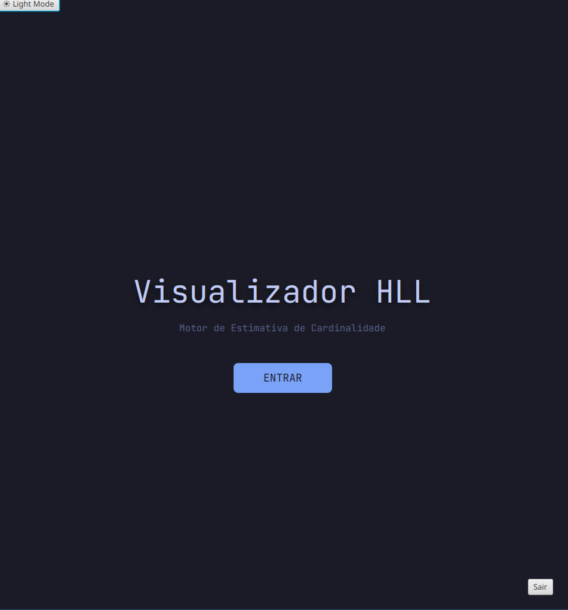
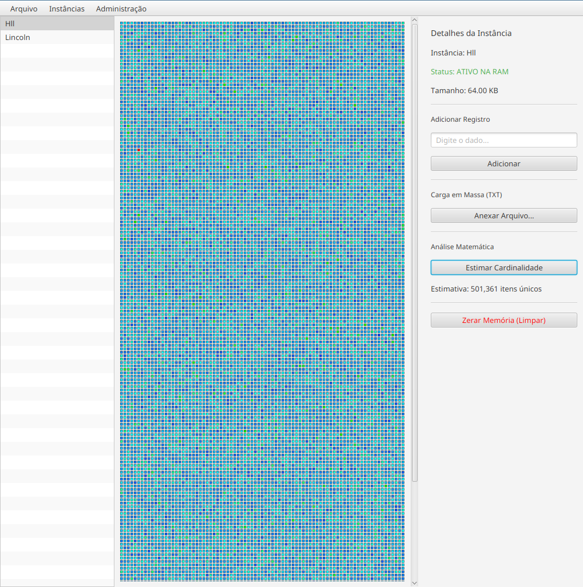
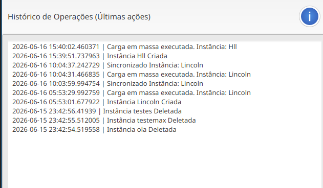

# 🐘 Estimador de Cardinalidade com HyperLogLog


Aplicação desenvolvida em **Java** com interface gráfica em **JavaFX**, implementando o algoritmo matemático probabilístico **HyperLogLog** para estimativa de cardinalidade (contagem de itens únicos) em grandes volumes de dados.


---

## 🚀  Filosofia
A contagem tradicional de itens únicos (ex: contar 1 bilhão de IPs diferentes de um servidor) exige o armazenamento completo de todos os itens na memória (`HashSet`), o que consome Gigabytes de RAM.

A estrutura de dados **HyperLogLog** resolve isso. Utilizando matemática probabilística (Média Harmônica e funções de Hash), o sistema consegue analisar milhões de registros ocupando uma quantidade ínfima de memória (aprox. 16 KB), com uma margem de erro inferior a 1%.

---

## ✨ Funcionalidades Principais

* **Motor Analítico (HLL):** Implementação nativa da matemática do HyperLogLog (Média harmônica e transição para *Linear Counting* em baixas cardinalidades).
* **Dashboard Reativo:** Interface que reflete o estado da memória RAM em tempo real através de um *Heatmap* de distribuição de bits.
* **Auto-Migração de Banco de Dados:** O sistema cria as próprias tabelas do PostgreSQL automaticamente na primeira execução (`Plug and Play`).
* **Arquitetura Desacoplada (MVC + DAO):** Separação estrita entre Interface Gráfica, Regras de Negócio e Persistência em disco.
* **Gestão e Auditoria (CRUD):** * Inserção e análise de arquivos de texto em massa.
    * Controle de acesso (Usuários).
    * Rastreabilidade total (Logs de Auditoria no banco de dados).

---

## 📂 Arquitetura e Estrutura do Código

O projeto segue o padrão **MVC (Model-View-Controller)**.


```text
src/
├── controller/      # Controladores de UI (DashboardController)
├── dao/             # Padrão Data Access Object (InstanciaDAO, UsuarioDAO, LogDAO)
├── model/           # O Motor Matemático (HyperLogLog)
├── util/            # Conexão com BD, Variáveis de Ambiente e Auto-migração
└── view/            # Arquivos FXML da Interface Gráfica
```





